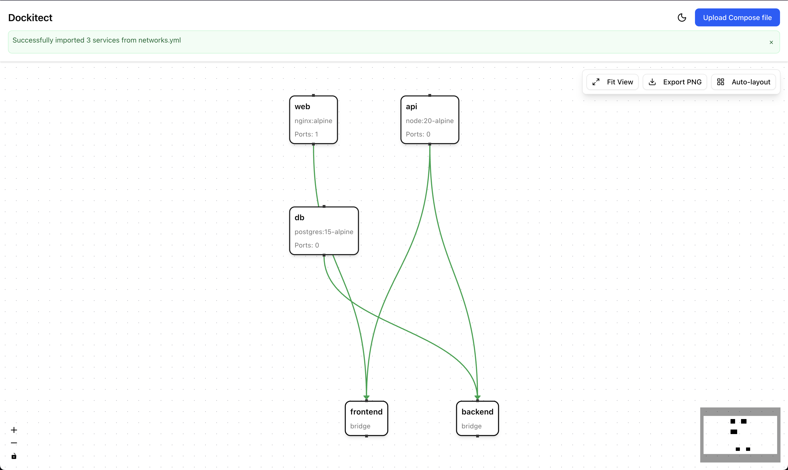
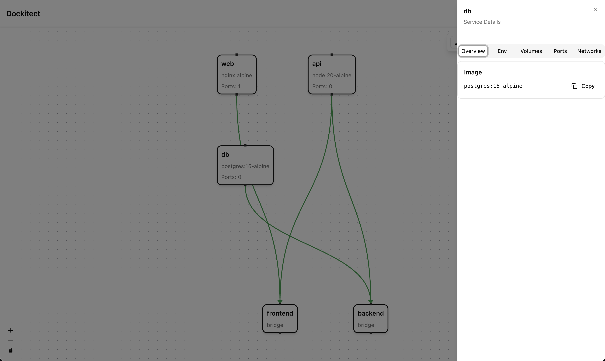
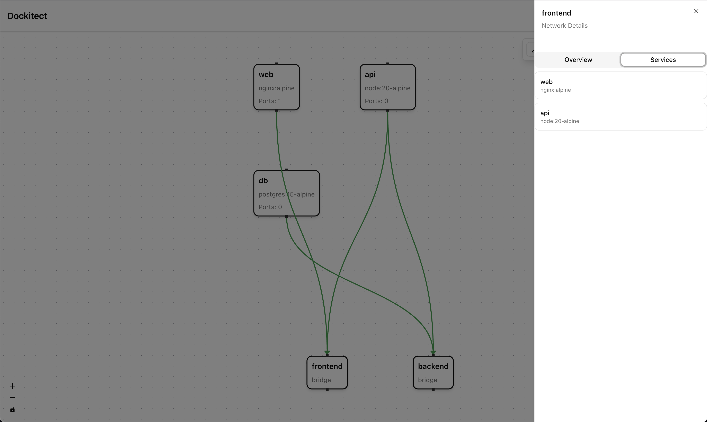
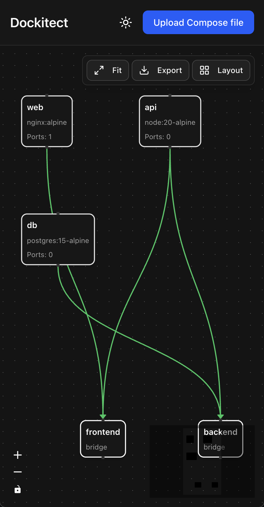

# Dockitect — Design your homelab. Export the stack.

[](https://github.com/av1155/Dockitect/actions/workflows/ci.yml)
[](https://opensource.org/licenses/MIT)

Draw your topology on a canvas, then export **deterministic `docker-compose.yml`** you can run anywhere. Import existing Compose to visualize and fix conflicts. Self-hosted, beautiful, and fast.

## Screenshots

<table>
  <tr>
    <td valign="top">
      <br/>
      <br/>
      
    </td>
    <td valign="top">
      
    </td>
  </tr>
</table>


---

## ✨ Why Dockitect?

Homelabs grow messy: scattered `docker-compose.yml` files, port collisions, no single source of truth. **Dockitect** bridges **design ↔ code**:

- **Visual canvas** for hosts, networks, and services (React Flow)
- **Import Compose** → see your lab as a graph
- **Export deterministic YAML** (clean diffs, perfect for Git)
- **Catch conflicts** before `docker compose up -d`
- **Appliance templates** (Jellyfin, Uptime Kuma, Immich, etc.)

---

## Features

- ✅ **Import Docker Compose files** - Upload and visualize your existing compose files
- ✅ **Visual Canvas** - Interactive node-based visualization with React Flow
- ✅ **Network Topology** - See connections between services and networks with styled edges
- ✅ **Interactive Nodes** - Click nodes to view full service/network details
- ✅ **Details Panel** - Comprehensive view of environment variables, volumes, ports, and networks
- ✅ **Canvas Controls** - Fit view, export as PNG, auto-layout functionality
- ✅ **Dark Mode** - Full dark mode support with theme toggle
- ✅ **Accessibility** - WCAG 2.2 AA compliant with keyboard navigation

## 🎯 Key Features (MVP Roadmap)

- [x] Repository setup with CI/CD pipeline
- [x] Next.js monorepo structure
- [x] TypeScript strict mode + ESLint + Prettier
- [x] React Flow canvas with Zustand state management
- [x] Blueprint v0 schema with Zod validation (34 tests)
- [x] Compose v2.x parser → Blueprint (23 tests, 6 fixtures)
- [ ] Canvas editor with Host / Network / Service nodes
- [x] File upload UI for Compose import (4 E2E tests)
- [ ] Export Blueprint → stable docker-compose.yml
- [ ] Port/volume/name conflict detection
- [ ] 5+ appliance templates (drag-and-drop)
- [ ] SQLite persistence for blueprints
- [ ] Light/dark theme

_See [roadmap.md](docs/product/roadmap.md) for full plan._

---

## 🚀 Quickstart

### Development

```bash
git clone https://github.com/av1155/Dockitect.git
cd Dockitect
pnpm install
pnpm dev
```

Visit `http://localhost:3000`

### Docker (Coming Soon)

```bash
docker run -d -p 3000:3000 \
  -v $(pwd)/dockitect-data:/data \
  ghcr.io/av1155/dockitect:latest
```

---

## 📁 Project Structure

```
apps/web/              # Next.js app (UI, API)
packages/
  schema/              # Blueprint Zod schema
  importer/            # Compose → Blueprint parser
  exporter/            # Blueprint → Compose generator
templates/appliances/  # Pre-built service templates
docs/                  # Documentation
  product/             # Roadmap, MVP spec, checklist
  tech/                # Architecture, ADRs
  how-to/              # User guides
```

---

## 🛠️ Tech Stack

**Frontend:**

- [Next.js 15](https://nextjs.org/) (App Router)
- [React Flow](https://reactflow.dev/) (Canvas)
- [Zustand](https://zustand.docs.pmnd.rs/) (State management)
- [Tailwind CSS](https://tailwindcss.com/) + [shadcn/ui](https://ui.shadcn.com/)

**Backend:**

- [Zod](https://zod.dev/) (Schema validation)
- [Prisma](https://www.prisma.io/) (Database ORM)
- SQLite (Persistence)

**Tooling:**

- [Turbo](https://turbo.build/) (Monorepo build system)
- [Vitest](https://vitest.dev/) (Unit tests)
- [Playwright](https://playwright.dev/) (E2E tests)
- GitHub Actions (CI/CD)

---

## 🤝 Contributing

We welcome contributions! Please read [CONTRIBUTING.md](CONTRIBUTING.md) for:

- Development setup
- Code style guide
- Testing requirements
- Pull request process

---

## 📄 License

[MIT License](LICENSE) — use freely, commercially or personally.

---

## 🗺️ Roadmap

Current phase: **P1 - MVP Importer (Compose v2.x → Blueprint)** 🚧 (80% complete)

Completed:

- ✅ **P0**: Repository & Project Setup
- ✅ **P1.1**: Blueprint v0 Schema (34 tests)
- ✅ **P1.2**: Compose v2.x Parser (23 tests, 18 fixtures)
- ✅ **P1.3**: File Upload UI Component (WCAG 2.2 AA compliant)
- ✅ **P1.4**: Canvas Rendering with Dark Mode (11 E2E tests)

Next up:

- **P1.5**: Network Edges & Node Interactivity
- **P1.6**: Import Validation & Error Handling
- **P2**: MVP Exporter (Blueprint → Compose v2.x)
- **P3**: Conflict Detection & Validation

See [docs/product/roadmap.md](docs/product/roadmap.md) for details.

---

## 📬 Support

- **Documentation**: [/docs](docs/)
- **Discussions**: [GitHub Discussions](https://github.com/av1155/Dockitect/discussions)
- **Bug Reports**: [Issue Tracker](https://github.com/av1155/Dockitect/issues/new/choose)
- **Security**: See [SECURITY.md](SECURITY.md)

---

**Built with ❤️ for the selfhosted community**
