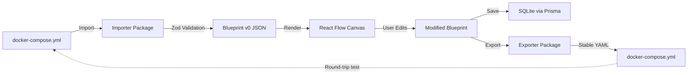

# Architecture Overview

## Monorepo Structure

```
dockitect/
├── apps/
│   └── web/              # Next.js frontend + API
├── packages/
│   ├── schema/           # Blueprint schema (Zod)
│   ├── importer/         # Compose → Blueprint
│   └── exporter/         # Blueprint → Compose
├── templates/
│   └── appliances/       # Pre-built stacks (JSON)
├── docs/
│   ├── product/          # Roadmap, MVP, checklist
│   ├── tech/             # Architecture, ADRs
│   ├── how-to/           # User guides
│   └── adr/              # Architecture Decision Records
└── .github/
    └── workflows/        # CI/CD pipelines
```

## Technology Stack

### Frontend

- **Framework**: Next.js 15 (App Router)
- **Language**: TypeScript (strict mode)
- **Styling**: Tailwind CSS + shadcn/ui (Radix primitives)
- **Canvas**: React Flow (`@xyflow/react`) for visual topology editor
- **State**: Zustand for global canvas state management
- **Forms**: React Hook Form + Zod validation

### Backend/Core

- **Schema**: Zod for runtime validation + TypeScript type inference
- **Database**: Prisma ORM + SQLite (file-based, bundled with app)
- **Parsing**: `yaml` npm package for docker-compose
- **Export**: `fast-json-stable-stringify` for deterministic output
- **Build**: Turbo (monorepo orchestration), pnpm workspaces

### Infrastructure

- **CI/CD**: GitHub Actions (typecheck, lint, test, build, e2e)
- **Deployment**: Docker multi-arch builds (linux/amd64, linux/arm64)
- **Registry**: GitHub Container Registry (GHCR)
- **Security**: CodeQL scanning, Dependabot, Renovate
- **Release**: semantic-release with Conventional Commits

## Core Principles

### 1. Privacy First

- **No telemetry by default**: App runs fully offline
- **Opt-in analytics**: If enabled post-MVP, use public schema and anonymous IDs
- **Local storage**: All blueprints stored in user-controlled SQLite file
- **No external API calls**: Templates bundled locally, no CDN dependencies

### 2. Security by Design

- **No Docker socket access**: App is a designer/editor, not a runtime manager
- **File-based only**: Import/export via filesystem, no container introspection
- **Unprivileged container**: Runs as non-root user in Docker
- **Input validation**: All imports validated against Zod schema before processing
- **90-day disclosure**: Coordinated security vulnerability reporting (SECURITY.md)

### 3. Deterministic Export

- **Stable key ordering**: Services, networks, volumes sorted alphabetically
- **Stable array ordering**: Ports, env vars, volumes maintain consistent order within services
- **Reproducible output**: Multiple exports produce identical diffs (critical for Git workflows)
- **Why it matters**: Clean diffs = easy code review = star-winning UX for developers

### 4. Type Safety

- **Schema-first**: Blueprint defined in Zod, generates TypeScript types
- **Runtime validation**: All user inputs validated at runtime (no silent failures)
- **End-to-end types**: Shared schema across importer, exporter, UI, database

### 5. Modularity

- **Separate concerns**: Schema, import, export, UI in distinct packages
- **Testable**: Each package independently testable with fixtures
- **Extensible**: Plugin-ready architecture for future templates, exporters (K8s, Podman)

### 6. Portability

- **Offline-first**: Works without internet connection
- **Self-contained**: Single Docker image includes app + SQLite
- **No backend required**: MVP runs entirely in browser + local filesystem (Next.js API routes for persistence)
- **Multi-platform**: Runs on amd64 and arm64 (Raspberry Pi, NAS, x86 servers)

## Blueprint Schema

The Blueprint v0 schema is the core data model powering Dockitect's import, export, and canvas rendering.

**Package**: `@dockitect/schema`

**Location**: `/packages/schema/src/blueprint.ts`

### Core Entities

- **Blueprint**: Root type containing version, metadata, hosts, networks, and services
- **Host**: Physical/virtual machine (e.g., NAS, Pi, VM)
- **Network**: Docker network with optional driver and subnet configuration
- **Service**: Containerized service with image, ports, volumes, environment, etc.

### Validation

All Blueprint instances are validated using Zod schemas with:

- Runtime type checking
- UUID validation for entity IDs
- Port range validation (1-65535)
- Datetime validation for timestamps
- Enum validation for restart policies and protocols

### JSON Schema Export

The package exports a JSON Schema representation via `getBlueprintJsonSchema()` for API documentation and external tooling.

### Example Blueprint

```typescript
const blueprint: Blueprint = {
  version: "v0",
  meta: {
    id: "123e4567-e89b-12d3-a456-426614174000",
    name: "Jellyfin Stack",
    createdAt: "2025-01-01T00:00:00Z",
    updatedAt: "2025-01-01T00:00:00Z",
  },
  hosts: [
    {
      id: "223e4567-e89b-12d3-a456-426614174001",
      name: "nas",
      notes: "Primary storage server",
    },
  ],
  networks: [
    {
      id: "323e4567-e89b-12d3-a456-426614174002",
      name: "media",
      driver: "bridge",
    },
  ],
  services: [
    {
      id: "423e4567-e89b-12d3-a456-426614174003",
      name: "jellyfin",
      image: "jellyfin/jellyfin:latest",
      ports: [{ host: 8096, container: 8096, protocol: "tcp" }],
      volumes: [
        { type: "bind", source: "/mnt/media", target: "/media", readOnly: true },
      ],
      networks: ["323e4567-e89b-12d3-a456-426614174002"],
      restart: "unless-stopped",
      hostId: "223e4567-e89b-12d3-a456-426614174001",
    },
  ],
};
```

See [ADR 0001](../adr/0001-blueprint-schema.md) for design rationale.

## Data Flow



### Importer Data Flow (P1.2 - Implemented)

The importer package (`@dockitect/importer`) transforms docker-compose.yml files into validated Blueprint v0 structures:

1. **YAML Parsing**: Uses `yaml` package to parse Compose v2.x files
2. **Entity Extraction**:
   - Services → Blueprint services with UUIDs
   - Networks → Blueprint networks with driver/subnet config
   - Volumes → Classified as bind mounts or named volumes
3. **Relationship Mapping**:
   - Service dependencies via `depends_on`
   - Network connections via service.networks
   - Volume mounts with read-only flags
4. **Port & Environment Parsing**:
   - Port mappings: `"8080:80/tcp"` → `{host: 8080, container: 80, protocol: "tcp"}`
   - Environment variables: Array or object format → normalized object
5. **UUID Generation**: All entities assigned UUIDs for internal references
6. **Zod Validation**: Final Blueprint validated against schema before return

**Supported Features**:
- Services (image, command, env, ports, volumes, networks, depends_on, restart, labels)
- Networks (name, driver, subnet CIDR via IPAM)
- Volumes (bind mounts with `:ro` flag, named volumes)
- Ports (TCP/UDP protocol support)
- Dependencies (service startup order)

**Error Handling**:
- Invalid YAML syntax
- Missing required fields (service image)
- Undefined network/service references
- Invalid port formats
- Schema validation failures

### Canvas Rendering (P1.5 - Implemented)

- Location: `apps/web/lib/blueprintToNodes.ts`
- Converter: `blueprintToNodes(blueprint)` returns `{ nodes, edges }` consumed by React Flow
- Hierarchical auto-layout (top-down):
  - Services at the top arranged on a grid
    - `spacing = 200`
    - `cols = ceil(sqrt(max(1, serviceCount)))`
    - `maxServiceRows = ceil(serviceCount / cols)`
    - Position per service: `{ x: col * spacing, y: row * spacing }`
  - Networks below services on a single horizontal row
    - `networkGap = 150`; `networkY = maxServiceRows * spacing + networkGap`
    - Horizontal centering:
      - `totalServiceWidth = cols * spacing`
      - `networkStartX = networkCount > 1 ? max(0, (totalServiceWidth - (networkCount - 1) * spacing) / 2) : totalServiceWidth / 2 - 100`
    - Position per network: `{ x: networkStartX + index * spacing, y: networkY }`
- Edges:
  - For each `service.networks[]`, create an edge: `service-${service.id}` → `network-${netId}`
  - Styling:
    - type: `bezier` (curved)
    - color: `var(--success)` (green)
    - strokeWidth: `2`
    - arrow markers: `MarkerType.ArrowClosed`
    - animated: `false` (respects prefers-reduced-motion)
 
 Components:
  - `ServiceNode` (`apps/web/components/nodes/ServiceNode.tsx`)
    - Renders service name, image, and ports count
    - Accessibility: `role="button"`, ARIA labels, top/bottom handles
    - Click handler updates `selectedNode`
    - Keyboard: Tab focusable (tabIndex=0); Enter/Space open details
    - Hover: subtle scale and drop shadow for affordance
    - Design token: primary border color via `border-primary` token
  - `NetworkNode` (`apps/web/components/nodes/NetworkNode.tsx`)
    - Renders network name and driver (defaults to `bridge`)
    - Accessibility: `role="button"`, ARIA labels, top/bottom handles
    - Click handler updates `selectedNode`
    - Keyboard: Tab focusable (tabIndex=0); Enter/Space open details
    - Hover: subtle scale and drop shadow for affordance
    - Design token: success border color (`var(--success)`) for network semantics
 
 ## Node Interaction & Details Panel (P1.5)
 
 **State Management:**
- `selectedNode: Node | null` in Zustand store (`apps/web/lib/store.ts`)
- `setBlueprint(blueprint)` computes `{ nodes, edges }` via `blueprintToNodes` and updates store
- Set via click handlers in ServiceNode and NetworkNode components (click or Enter/Space)
- Auto-fit view after blueprint load and on auto-layout: `fitView({ padding: 0.2, duration: 300 })`
- Cleared when details panel closes (Esc, outside click, Sheet onOpenChange)
 
 **Components:**
 
 1. **NodeDetailsPanel** (`apps/web/components/NodeDetailsPanel.tsx`)
    - Radix UI Sheet component (accessible, keyboard-friendly)
    - Tabs: Overview, Environment, Volumes, Ports, Networks
    - Copy-to-clipboard for values (navigator.clipboard API)
    - Keyboard: Tab navigation, Enter/Space to activate, Esc to close
 
  2. **CanvasControls** (`apps/web/components/CanvasControls.tsx`)
     - React Flow Panel positioned at top-right
     - Buttons: Fit View, Export PNG, Auto-layout
     - Fit View: calls `fitView({ padding: 0.2, duration: 300 })`
     - PNG export uses html-to-image library targeting `.react-flow` container and filters out Controls/Minimap/Panel
     - Auto-layout: re-applies `blueprintToNodes(blueprint)` then calls Fit View
 
  **Accessibility & Keyboard Navigation (P1.5):**
  - All interactive nodes have role="button", tabIndex={0}
  - Keyboard support: Tab to focus; Enter/Space to open details
  - Esc closes the details panel (Radix Sheet onOpenChange)
  - Focus-visible rings for keyboard navigation
  - ARIA labels on all controls and buttons
  - Details panel implements focus trap (via Radix Sheet)
 
  **Layout & Positioning:**
  - React Flow Controls: bottom-left
  - MiniMap: bottom-right (160x110px)
  - CanvasControls: top-right (card wrapper for visibility)
  - Network nodes: positioned below services with horizontal centering
  - Edge elevation: `elevateEdgesOnSelect` for visibility
 
  **Edge Styling (P1.5):**
  - Type: bezier (curved)
  - Color: `var(--success)` (green)
  - Stroke width: 2px
  - Arrow markers: ArrowClosed type
  - Not animated (honors prefers-reduced-motion)
 
 ## User Interactions (P1.5)
 
 - Click a service or network node → opens Node Details Panel
 - Esc key → closes the panel (and clears `selectedNode`)
 - Keyboard: Tab to focus nodes/controls; Enter/Space to activate/open
 - Fit View → auto-fits the graph with padding and 300ms animation
 - Export PNG → captures the canvas (nodes/edges) and excludes controls/minimap/panels
 - Auto-layout → re-applies hierarchical positioning (services on top, networks below) and triggers Fit View
 
  **Dark Mode Theming** (P1.5):
- React Flow `colorMode` prop with theme detection via MutationObserver
- CSS variables mapped to design tokens for Controls and MiniMap
- ThemeToggle component (`apps/web/components/ThemeToggle.tsx`) with localStorage persistence
- CSS variable customization in `apps/web/app/globals.css`:
  - `--xy-controls-button-background-color-default/hover-default`
  - `--xy-controls-button-border-color-default`
  - `--xy-minimap-background-color-default`
  - Values mapped to: `var(--card)`, `var(--secondary)`, `var(--border)`, `var(--foreground)`

Notes on design tokens:
- Services use the primary token via Tailwind `border-primary`
- Networks use the success token (`var(--success)`) to differentiate infrastructure links
- Tokens align with the project style guide in `context/style-guide.md`
- Dark mode maintains WCAG 2.2 AA contrast ratios

### Layout Algorithms (P4.5 - Planned)

Dockitect will support multiple layout algorithms to handle different topology patterns, especially sparse/flat stacks that lack explicit network connections.

**Layout Modes:**
- **Grid** (P1.4 - current): Simple grid layout with services in rows, networks below
- **Hierarchical** (P4.5): Top-down dependency flow using dagre or custom algorithm
- **Radial** (P4.5): Center-outward circular layout with network/volume at center
- **Force-directed** (P4.5): Physics-based organic layout using elkjs for natural clustering
- **Swimlanes** (P4.5): Horizontal lanes grouping services by function/type

**Semantic Grouping:**

For topologies with minimal explicit connections (e.g., `network_mode: host`), services are grouped by:
- **Image family**: All linuxserver.io services cluster together, official images separate
- **Shared volumes**: Services mounting the same path show visual link
- **Dependencies**: `depends_on` chains displayed with dotted edges
- **Labels**: Custom `dockitect.group` labels for manual grouping

**Visual Indicators:**
- Dotted edges for `depends_on` relationships (even without network connection)
- Port exposure badges showing which services expose ports to host
- Volume sharing indicators between services mounting same path
- Color-coding by image registry (linuxserver.io, ghcr.io, docker.io, custom)

**Implementation:**
- Location: `apps/web/lib/layouts/` - Individual layout algorithms
- Location: `apps/web/lib/grouping/` - Semantic grouping utilities
- UI: Layout selector dropdown + "Beautify" button in canvas toolbar
- State: Layout mode persists in project settings via Zustand + localStorage
- Manual positioning: User can lock nodes to prevent beautify from moving them

**Dependencies:**
- `@dagrejs/dagre` - Hierarchical graph layout
- `elkjs` - Force-directed layout engine
- React Flow's positioning utilities for radial and swimlane layouts


## Key Design Decisions

### Why Not Use docker-compose.yml Directly?

- **Separation of concerns**: Blueprint (design artifact) vs. Compose (deployment artifact)
- **Conflict detection**: Validate port/volume/name collisions before export
- **Multi-target**: Future export to Kubernetes, Podman without changing core model
- **Canvas metadata**: Store node positions, UI state without polluting Compose output

See [ADR 0001](../adr/0001-blueprint-schema.md) for full rationale.

### Why SQLite Over PostgreSQL/MySQL?

- **Self-hosted UX**: Single-file database, no external service required
- **Portability**: Works on NAS, Pi, low-power devices
- **Backup simplicity**: Copy one file to backup all blueprints
- **Zero config**: No connection strings, no network ports

### Why Monorepo?

- **Shared schema**: Single source of truth (Blueprint v0) used by all packages
- **Atomic changes**: Update schema + importer + exporter in one PR
- **Simplified CI**: One test suite, one build command
- **Turborepo**: Fast incremental builds, caching across CI runs

### Why Zustand for State Management?

- **Minimal boilerplate**: No providers, no context wrapping
- **TypeScript-first**: Full type inference and safety
- **Devtools**: React DevTools integration for debugging
- **Performance**: Selective re-renders without manual optimization
- **Small bundle**: <1KB gzipped vs Redux/MobX
- **Perfect for canvas**: Manages nodes, edges, and UI state in a single store

## Testing Strategy

### Unit Tests (Vitest)

- **Packages**: schema, importer, exporter (≥80% coverage)
- **Fixtures**: 5+ docker-compose examples (simple, multi-service, networks, volumes, ports)
- **Round-trip**: `compose → blueprint → compose` (semantic equivalence)

### E2E Tests (Playwright)

- **Critical paths**: Upload compose, edit canvas, export compose, save blueprint
- **Conflict detection**: Import conflicting ports, verify error panel shown
- **Templates**: Drag Jellyfin template, verify nodes rendered

### Integration Tests

- **Database migrations**: Test Prisma schema changes with seed data
- **Export validation**: Run `docker compose config` on exported files (validate against Compose spec)

## Performance Considerations

- **Canvas rendering**: React Flow optimized for <100 nodes (sufficient for homelab scale)
- **Database queries**: Indexed by project ID, <50ms reads
- **Export speed**: Target <2s for 20-service compose (P7 success metric)

### Layout Performance (P4.5)

- **Layout calculation**: Target <200ms for graphs with <50 nodes
- **Force-directed layout**: Run in web worker for graphs >20 nodes to prevent UI blocking
- **Collision detection**: Bounding box checks to prevent overlapping nodes
- **Caching**: Memoize layout results until blueprint changes

## Future Extensions (Post-MVP)

- **Multi-host orchestration**: Deploy to multiple Docker hosts via SSH/API
- **Kubernetes export**: Blueprint → Helm chart or raw YAML
- **Template marketplace**: Community-contributed appliances
- **Live container introspection**: Optional sidecar with Docker socket (opt-in)
- **Advanced IPAM**: Subnet calculator, IP address assignment
- **Secrets management**: Integrate with external vaults (HashiCorp, Doppler)

## References

- [Blueprint v0 Schema (ADR 0001)](../adr/0001-blueprint-schema.md)
- [Dockitect Vision](../../Dockitect.md)
- [Docker Compose Specification v2.x](https://docs.docker.com/compose/compose-file/)
- [React Flow Documentation](https://reactflow.dev/)
